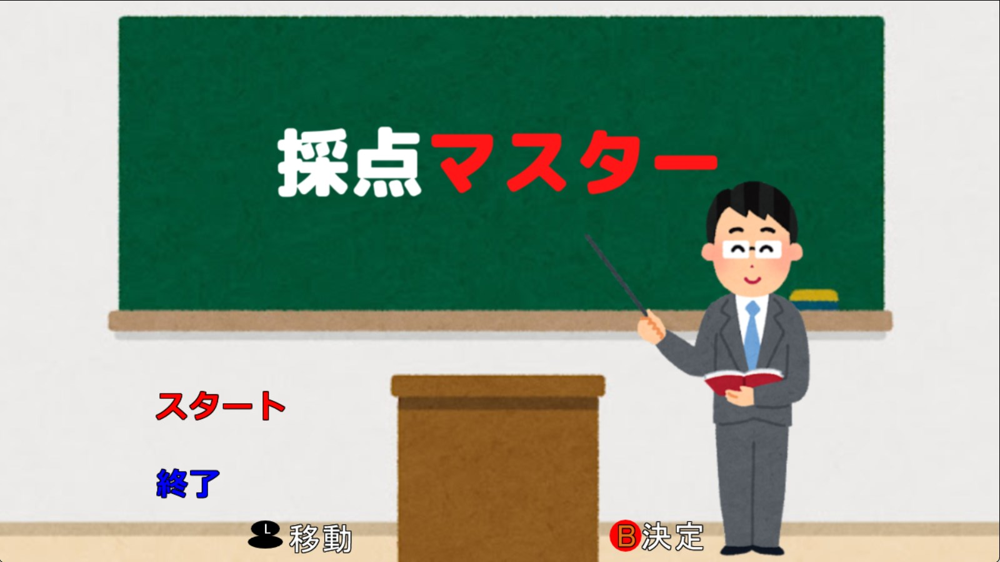

# 採点マスター
制限時間(100秒)以内に問題に対して生徒の答えが〇か✕かどれだけ正確に解答できるか競うゲームです。
🔗[紹介サイト](https://miyagi-yuta.com/scoringmaster/)

## **動作環境**

対象OS：Windows 10 以降  
操作機器：コントローラー(XInputのみ)
 
## 操作方法

### タイトル画面

|入力|動作|
|---|---|
|左スティック上下|選択|
|B|決定|

### ゲーム画面

|入力|動作|
|---|---|
|B|赤のタイルを踏む|
|A|緑のタイルを踏む|
|Y|黄色のタイルを踏む|
|X|青のタイルを踏む|

## ライセンス  

### 音声
DOVA-SYNDROME／Hupple  
DOVA-SYNDROME／マニーラ

### 画像
いらすとや 
